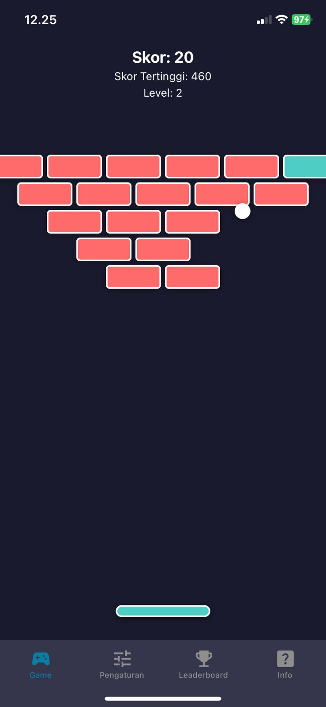
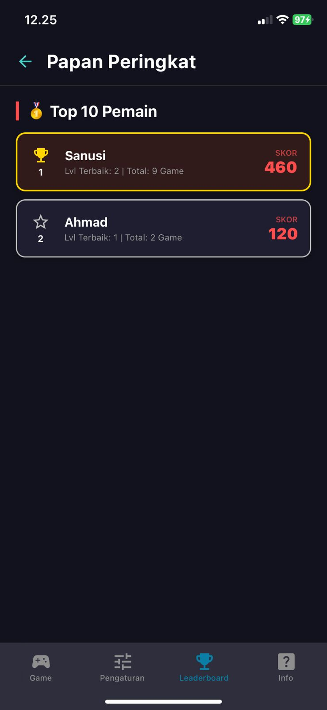
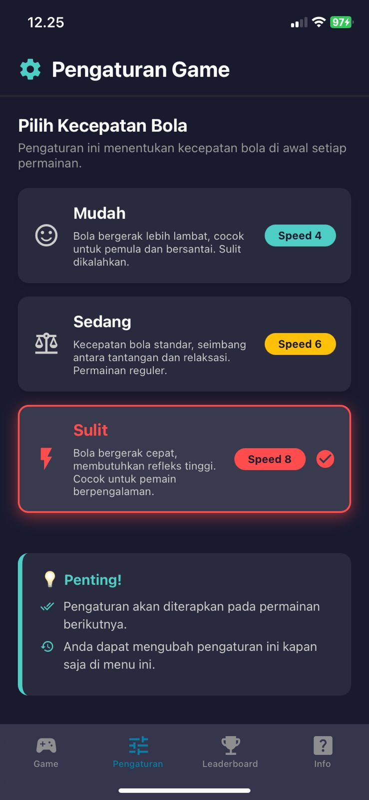
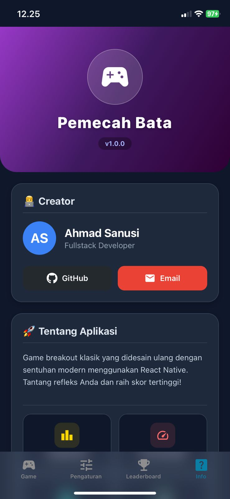

# 🎮 Pemecah Bata - Game Breakout Sederhana

Game Breakout/Brick Breaker klasik yang dibuat dengan React Native dan Expo. Hancurkan semua bata dengan bola yang memantul!

## 📸 Screenshot Aplikasi

<div align="center">
  
  
</div>

<div align="center">
  
  
</div>

## 📋 Daftar Isi

- [Fitur](#-fitur)
- [Screenshot Aplikasi](#-screenshot-aplikasi)
- [Teknologi yang Digunakan](#-teknologi-yang-digunakan)
- [Persyaratan](#-persyaratan)
- [Instalasi](#-instalasi)
- [Cara Menjalankan](#-cara-menjalankan)
- [Cara Bermain](#-cara-bermain)
- [Struktur Proyek](#-struktur-proyek)
- [Fitur Game](#-fitur-game)
- [Kontribusi](#-kontribusi)
- [Lisensi](#-lisensi)

## ✨ Fitur

- 🎯 **Gameplay Klasik**: Game Breakout yang menyenangkan dan adiktif
- 🎨 **Visual Menarik**: Desain modern dengan warna-warna cerah
- 📊 **Sistem Skor**: Skor dan skor tertinggi yang tersimpan
- 🎮 **Level System**: Level meningkat otomatis saat semua bata hancur
- 📱 **Responsif**: Dapat dimainkan di Android, iOS, dan Web
- 🎪 **Kontrol Mudah**: Geser jari untuk menggerakkan papan
- 🌈 **Bata Berwarna**: Setiap baris bata memiliki warna berbeda

## 🛠 Teknologi yang Digunakan

- **React Native**: Framework untuk membangun aplikasi mobile
- **Expo**: Platform untuk pengembangan React Native
- **TypeScript**: Bahasa pemrograman dengan type safety
- **Animated API**: Untuk animasi yang halus
- **React Hooks**: Untuk manajemen state

## 📦 Persyaratan

Sebelum memulai, pastikan Anda telah menginstall:

- **Node.js** (versi 16 atau lebih tinggi)
- **npm** atau **yarn**
- **Expo CLI**: `npm install -g expo-cli`
- **Expo Go** (untuk testing di mobile): Download dari [App Store](https://apps.apple.com/app/expo-go/id982107779) atau [Google Play](https://play.google.com/store/apps/details?id=host.exp.exponent)

## 🚀 Instalasi

1. **Clone repository ini**
   ```bash
   git clone https://github.com/Ahmadsanusi18/Game-pemecahbata-sederhana.git
   cd Game-pemecahbata-sederhana
   ```

2. **Install dependencies**
   ```bash
   npm install
   ```
   atau
   ```bash
   yarn install
   ```

## ▶️ Cara Menjalankan

### Development Mode

1. **Jalankan development server**
   ```bash
   npm start
   ```
   atau
   ```bash
   yarn start
   ```

2. **Pilih platform yang ingin digunakan:**
   - Tekan `a` untuk Android
   - Tekan `i` untuk iOS (hanya macOS)
   - Tekan `w` untuk Web
   - Scan QR code dengan Expo Go app di smartphone Anda

### Build untuk Production

#### Android
```bash
npm run android
```

#### iOS (hanya macOS)
```bash
npm run ios
```

#### Web
```bash
npm run web
```

## 🎮 Cara Bermain

1. **Mulai Game**: Ketuk layar untuk memulai permainan
2. **Gerakkan Papan**: Geser jari di layar untuk menggerakkan papan ke kiri atau kanan
3. **Hancurkan Bata**: Pantulkan bola ke bata untuk menghancurkannya
4. **Jangan Biarkan Bola Jatuh**: Jaga bola agar tetap memantul di layar
5. **Kumpulkan Skor**: Setiap bata yang hancur memberikan 10 poin
6. **Naik Level**: Hancurkan semua bata untuk naik ke level berikutnya

### Tips Bermain

- ⚡ **Gunakan Sudut**: Pantulkan bola dengan sudut yang berbeda untuk mencapai bata yang sulit dijangkau
- 🎯 **Aim dengan Tepat**: Posisi papan saat bola memantul menentukan arah bola
- 🏆 **Fokus pada Bata**: Prioritaskan menghancurkan semua bata daripada hanya menjaga bola tetap hidup
- 💪 **Latihan**: Semakin sering bermain, semakin baik kontrol Anda

## 📁 Struktur Proyek

```
game-tetris-pemecah_bata-sederhana/
├── app/
│   ├── (tabs)/
│   │   └── index.tsx          # File utama game
│   └── _layout.tsx            # Layout aplikasi
├── assets/                    # Gambar dan resources
├── components/                # Komponen reusable
├── constants/                 # Konstanta aplikasi
├── hooks/                     # Custom hooks
├── package.json              # Dependencies
├── tsconfig.json             # Konfigurasi TypeScript
└── README.md                 # Dokumentasi
```

## 🎯 Fitur Game

### Gameplay Mechanics

- **Fisika Bola**: Bola memantul dengan realistis dari dinding, papan, dan bata
- **Collision Detection**: Deteksi tabrakan yang akurat untuk semua elemen
- **Sudut Pantulan**: Sudut pantulan berdasarkan posisi tumbukan di papan
- **Kecepatan Dinamis**: Kecepatan bola tetap konsisten untuk gameplay yang adil

### Sistem Skor

- **Skor**: +10 poin per bata yang hancur
- **Skor Tertinggi**: Tersimpan otomatis selama sesi permainan
- **Level**: Meningkat otomatis saat semua bata hancur

### Visual Design

- **Bata Berwarna**: Setiap baris memiliki warna berbeda
  - Baris 1: Merah (#ff6b6b)
  - Baris 2: Cyan (#4ecdc4)
  - Baris 3: Biru (#45b7d1)
  - Baris 4: Kuning (#f9ca24)
  - Baris 5: Ungu (#6c5ce7)
- **Background Gelap**: Background hitam untuk kontras yang baik
- **Animasi Halus**: Menggunakan Animated API untuk transisi yang mulus

## 🎨 Konfigurasi Game

Anda dapat mengubah konstanta game di file `app/(tabs)/index.tsx`:

```typescript
const BALL_SIZE = 20;              // Ukuran bola
const PADDLE_WIDTH = 120;          // Lebar papan
const PADDLE_HEIGHT = 15;          // Tinggi papan
const BRICK_WIDTH = 70;            // Lebar bata
const BRICK_HEIGHT = 30;           // Tinggi bata
const BRICK_ROWS = 5;              // Jumlah baris bata
const BRICK_COLS = 5;              // Jumlah kolom bata
const BALL_SPEED = 6;              // Kecepatan bola
```

## 🐛 Troubleshooting

### Masalah Umum

1. **Game tidak bisa dimulai**
   - Pastikan semua dependencies terinstall: `npm install`
   - Restart development server: `npm start`

2. **Papan tidak bisa digerakkan**
   - Pastikan game sudah dimulai (tap layar untuk mulai)
   - Coba restart aplikasi

3. **Bola tidak memantul dengan benar**
   - Pastikan collision detection bekerja dengan baik
   - Periksa konstanta kecepatan bola

## 🤝 Kontribusi

Kontribusi sangat diterima! Jika Anda ingin berkontribusi:

1. Fork repository ini
2. Buat branch fitur baru (`git checkout -b fitur/AmazingFeature`)
3. Commit perubahan Anda (`git commit -m 'Menambahkan fitur AmazingFeature'`)
4. Push ke branch (`git push origin fitur/AmazingFeature`)
5. Buka Pull Request

### Ide Kontribusi

- 🎵 Menambahkan efek suara
- 🎨 Menambahkan lebih banyak variasi warna bata
- 💎 Menambahkan power-up (bola lebih besar, papan lebih lebar, dll)
- 🏆 Menambahkan leaderboard online
- 📱 Menambahkan mode multiplayer
- 🎯 Menambahkan mode tantangan khusus

## 📝 Changelog

### Version 1.0.0 (Current)
- ✅ Gameplay dasar Breakout
- ✅ Sistem skor dan level
- ✅ Kontrol dengan geser jari
- ✅ Bata berwarna-warni
- ✅ UI dalam bahasa Indonesia

## 📄 Lisensi

Proyek ini menggunakan lisensi MIT. Lihat file `LICENSE` untuk detail lebih lanjut.

## 👤 Author

**Edisuherlan**
- GitHub: [@edisuherlan](https://github.com/Ahmadsanusi18)
- Repository: [game-tetris-pemecah_bata-sederhana](https://github.com/Ahmadsanusi18/Game-pemecahbata-sederhana)

## 🙏 Acknowledgments

- Terinspirasi dari game Breakout klasik
- Dibuat dengan React Native dan Expo
- Menggunakan TypeScript untuk type safety

## 📞 Support

Jika Anda memiliki pertanyaan atau menemukan bug, silakan buka [issue](https://github.com/Ahmadsanusi18/Game-pemecahbata-sederhana/issues) di repository ini.

---

⭐ Jika Anda menyukai proyek ini, jangan lupa berikan star di GitHub!
